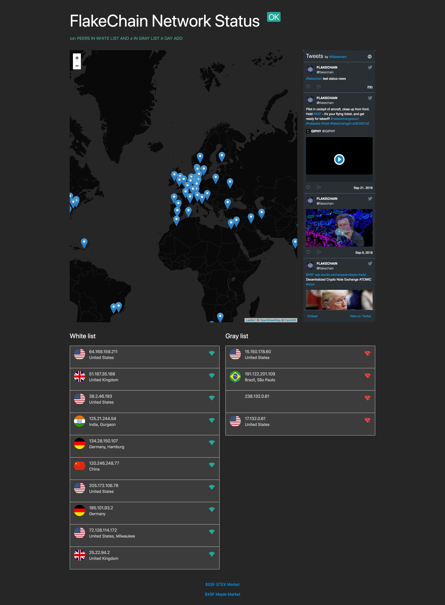

# Monero Ping v0.0.1ᴬᴸᴾᴴᴬ

### Description

Service to locate Monero or any fork peers and visualize on Leaflet Map.



### Deploy

Start new `tmux` session (advanced level users may use any flavor terminal multiplexer): 

```
$ tmux new
```

Install public `bower` dependencies:

```
$ npm install bower -g # to install bower
$ bower install
```

Activate `virtual environment` to keep system wide Python clean

```
$ python -m venv venv
$ . venv/bin/activate
```

Install dependencies

```
$ (venv) pip install -r requirements.txt
```

Run worker to check network periodically

```
$ (venv) python worker.py
```

Press `Ctrl+B Ctrl+C` to create new `tmux` window
and run `web application server` to handle requests:

```
$ . venv/bin/activate
$ (venv) python main.py
```

##### Invest into **$XSF** to support further Project development:

[STEX XSF/BTC](https://app.stex.com/en/basic-trade/pair/BTC/XSF/1D)

[Maple XSF/BTC](https://maplechange.com/markets/xsfbtc?markets=all&column=name&order=asc&unit=volume&pinned=true)

### Copyright

[@CRYPTOFOUNDARY](https://github.com/cryptofoundary)
